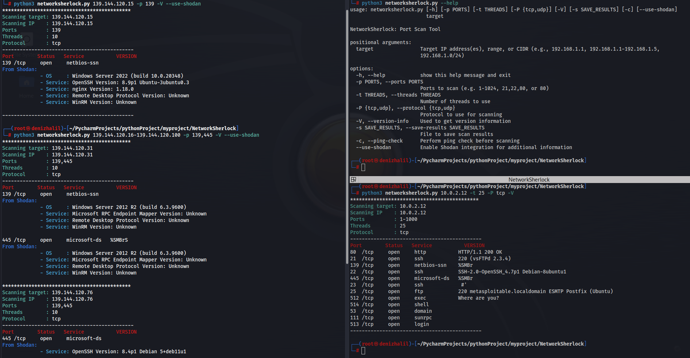

# **NetworkSherlock: Porwerfull Port Scanning With Shodan**
</img>

**NetworkSherlock** is a powerful and flexible port scanning tool designed for network security professionals and penetration testers. 
With its advanced capabilities, NetworkSherlock can efficiently scan IP ranges, CIDR blocks, and multiple targets. 
It stands out with its detailed banner grabbing capabilities across various protocols and integration with Shodan, the world's premier service for scanning and analyzing internet-connected devices. 
This Shodan integration enables NetworkSherlock to provide enhanced scanning capabilities, giving users deeper insights into network vulnerabilities and potential threats. 
By combining local port scanning with Shodan's extensive database, NetworkSherlock offers a comprehensive tool for identifying and analyzing network security issues.


## **Features**

- Scans multiple IPs, IP ranges, and CIDR blocks.
- Supports port scanning over TCP and UDP protocols.
- Detailed banner grabbing feature.
- Ping check for identifying reachable targets.
- Multi-threading support for fast scanning operations.
- Option to save scan results to a file.
- Provides detailed version information.
- Colorful console output for better readability.
- Shodan integration for enhanced scanning capabilities.
- Configuration file support for Shodan API key.

  
## **Installation**
NetworkSherlock requires Python 3.6 or later.

1. Clone the repository:
    ```bash
    git clone https://github.com/HalilDeniz/NetworkSherlock.git
    ```
2. Install the required packages:
    ```bash
    pip install -r requirements.txt
    ```
## Configuration

Update the `networksherlock.cfg` file with your Shodan API key:

```ini
[SHODAN]
api_key = YOUR_SHODAN_API_KEY
```

## **Usage**

```bash
python3 networksherlock.py --help
usage: networksherlock.py [-h] [-p PORTS] [-t THREADS] [-P {tcp,udp}] [-V] [-s SAVE_RESULTS] [-c] target

NetworkSherlock: Port Scan Tool

positional arguments:
  target                Target IP address(es), range, or CIDR (e.g., 192.168.1.1, 192.168.1.1-192.168.1.5,
                        192.168.1.0/24)

options:
  -h, --help            show this help message and exit
  -p PORTS, --ports PORTS
                        Ports to scan (e.g. 1-1024, 21,22,80, or 80)
  -t THREADS, --threads THREADS
                        Number of threads to use
  -P {tcp,udp}, --protocol {tcp,udp}
                        Protocol to use for scanning
  -V, --version-info    Used to get version information
  -s SAVE_RESULTS, --save-results SAVE_RESULTS
                        File to save scan results
  -c, --ping-check      Perform ping check before scanning
  -ad, --arp-discover: Perform ARP discovery on the specified network.
  --use-shodan          Enable Shodan integration for additional information

```
### **Basic Parameters**

- `target`: The target IP address(es), IP range, or CIDR block to scan.
- `-p`, `--ports`: Ports to scan (e.g., 1-1000, 22,80,443).
- `-t`, `--threads`: Number of threads to use.
- `-P`, `--protocol`: Protocol to use for scanning (tcp or udp).
- `-V`, `--version-info`: Obtain version information during banner grabbing.
- `-s`, `--save-results`: Save results to the specified file.
- `-c`, `--ping-check`: Perform a ping check before scanning.
- `--use-shodan`: Enable Shodan integration.

## Usage Examples

Here are some usage examples of NetworkSherlock: [You can explore it here](https://denizhalil.com/2023/11/27/dosinator-denial-of-service-tool/)

## Contributing
Contributions are welcome! To contribute to NetworkSherlock, follow these steps:

1. Fork the repository.
2. Create a new branch for your feature or bug fix.
3. Make your changes and commit them.
4. Push your changes to your forked repository.
5. Open a pull request in the main repository.

## Contact
- Linktr :[Halil Deniz](https://linktr.ee/halildeniz)
- LinkedIn  : [Halil İbrahim Deniz](https://www.linkedin.com/in/halil-ibrahim-deniz/)
- TryHackMe : [halilovic](https://tryhackme.com/p/halilovic)
- Instagram : [deniz.halil333](https://www.instagram.com/deniz.halil333/)
- YouTube   : [HalilDeniz](https://www.youtube.com/c/HalilDeniz)
- Email: halildeniz313@gmail.com


## License
This project is licensed under the MIT License - see the [LICENSE](LICENSE) file for details.

## 💰 You can help me by Donating
  Thank you for considering supporting me! Your support enables me to dedicate more time and effort to creating useful tools like NetworkScherlock and developing new projects. By contributing, you're not only helping me improve existing tools but also inspiring new ideas and innovations. Your support plays a vital role in the growth of this project and future endeavors. Together, let's continue building and learning. Thank you!"<br>
  [](https://buymeacoffee.com/halildeniz) 
  [](https://patreon.com/denizhalil) 
